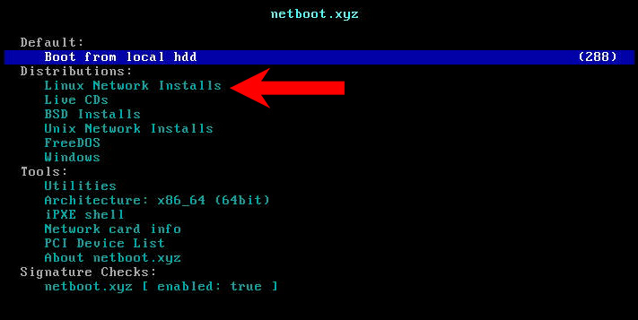
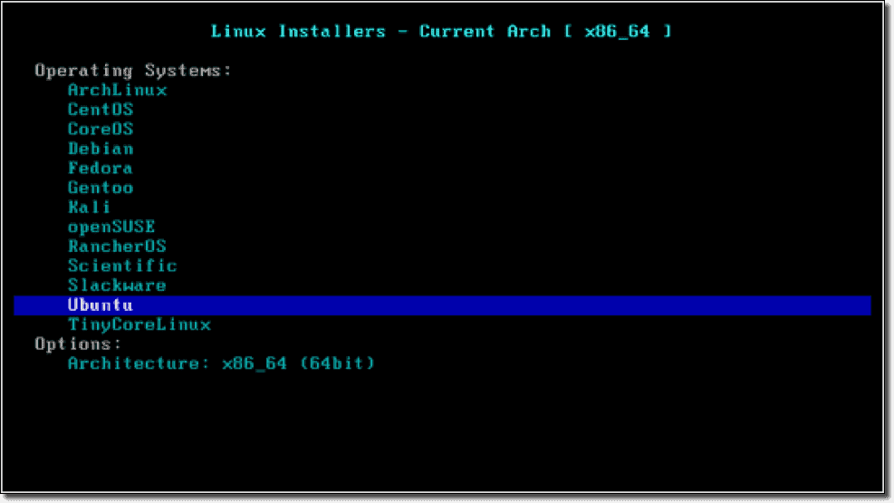

# Docker einrichten
Als erstes wird ein Verzeichnis für den Docker Container erstellt. 
```
mkdir /srv/docker/pxeboot
```
In diesem Verzeichnis muss ein Docker Compose erstellt werden.
```
nano /srv/docker/pxeboot/docker-compose.yml
```
In dieser Datei wird der Inhalt des Docker Compose eingefügt. Damit alle Verzeichnise automatisch erstellt werden, sollte das Compose kurz gestartet werden, und nachher wieder gestoppt.
```
cd /srv/docker/pxeboot
docker-compose up
ctrl + c
```
## DHCP Server konfigurieren
Im Verzeichnis data befindet sich ein dhcp Ordner. in diesem muss eine Datei mit dem Namen dhcpd.conf erstellt werden. 
```
cd /srv/docker/pxeboot/data/dhcp
nano dhcpd.conf
```
Hier wird nun der inhalt des dhcpd.conf Files eingefügt.
## NGINX Server konfigurieren
Im data Verzeichnis befindet sich ein nginx Ordner. In diesem muss das preseed.cfg File abgelegt werden. 
```
nano /srv/data/docker/pxeboot/data/nginx/html/preseed.cfg
```
Hier wird nun der Inhalt des preseed.cfg Files eingefügt. Die Container können jetzt gestartet werden.
```
docker-compose up -d
```
# Eigentlicher PXE-Boot
Zuerst muss der Laptop via LAN Kabel am Netz angeschlossen sein. Durch wiederholtes Drücken der F9 Taste nach dem Boot sollte das Boot Menu erscheinen. Hier kann nun IPv4 PXE ausgesucht werden.
Jetzt landet man im PXE Boot Menu. Folgendes sollte nun angeklickt werden.



Nun kann man das Betriebssystem auswählen das man möchte. Ganz unten in diesem Menu befindet sich Ubuntu.



Hier wird nun die Option mit (legacy) ausgesucht. Jetzt wählt man die ption "Specify preseed/autoinsall url..." aus. Anschliessend muss der Pfad zum Preseed File angegeben werden.
```
http://serverip/preseed.cfg
```
Falls nun noch ein Menu auftaucht, muss lediglich einmal Enter gedrückt werden und das Betriebssystem wird automatisch installiert.

# Installieren der Pakete im Anschluss

Zuerst muss git installiert werden, damit das Script von git geklont werden kann. Anschliessend kann man dieses ausführen.
```
sudo apt install git
git clone https://gitlab.com/mike_shootzz/pxe-boot-scripts.git
cd pxe-boot-scripts/ 
chmod +x Installer.sh 
sudo -s
./Installer.sh
```
Jetzt kann man zwischen den beiden Profilen auswählen und alle Pakete werden automatisch installiert.